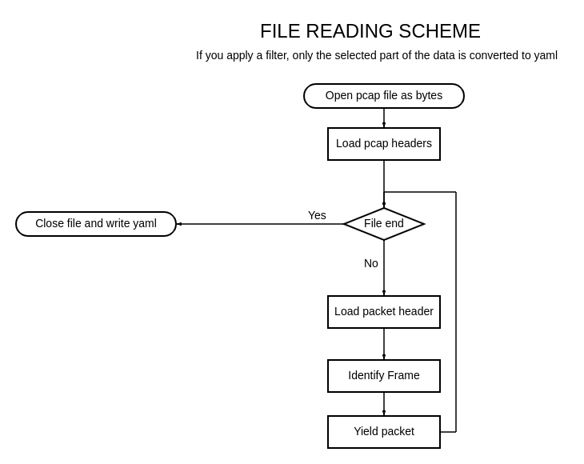

#  PCAPRIO 
### PCAP file analyzer


[](https://www.repostatus.org/#inactive)
[](https://www.python.org/downloads/release/python-390/)


At the moment, the functionality is not great. But it meets all the criteria of the project\
### Functions:
 - Data convert from pcap file to yaml format
 - Filter by protocols

## About:
The program reads data from a pcap file without using any libraries. 
First [`PCAPFile`](./pcaprio/pcap_file.py#L9) reads the header from the file. The header is stored in an object of class [`PCAPFileHeader`](./pcaprio/pcap_header.py#L5).\
Then when you call the [`PCAPFile.read_packets`](./pcaprio/pcap_file.py#L30) method you get a generator which reads the packets from the file.\
I found all the necessary information [here](https://www.ietf.org/archive/id/draft-gharris-opsawg-pcap-01.html#name-packet-record).\
Every packet ([`PCAPPacket`](./pcaprio/pcap_packet.py#L16)) has its own header. It doesn't make any sense for a job. But I do get it.\
The package has methods to output the contents in dict format (`PCAPPacket.as_dict`) and to examine the package (`PCAPPacket.parse`).\
The `PCAPPacket.parse` method calls `identify_frame`, which determines what type of frame is in the package. Next, you get the frames from the packet. They are: [`IEEE_802_3_LLC_Frame`](./pcaprio/frames/ieee_llc.py#L7), [`IEEE_802_3_LLC_SNAP_Frame`](./pcaprio/frames/ieee_llc_snap.py#L12), [`Ethernet2Frame`](./pcaprio/frames/ethernet2.py#L25). They contain all the necessary properties.




## Filters:
A basic filter is available. It is designed to simplify filtering.\
All filters are inherited from `IConversations`.\
The task of the filters is to get conversations of certain protocols.
### Filters:
- The [`ARPConversationsFilter`](./pcaprio/filters/arp_conversations.py#L23) looks for as many ARP packets with `ARPOpcode.REQUEST` and at least one `ARPOpcode.REPLY`. If both are present, the communication is successful.
- The [`ICMPConversationsFilter`](./pcaprio/filters/icmp_conversations.py#L11) looks for pairs of `Echo Rquest` and `Echo Reply` packets.
- The [`TCPConversationsFilter`](./pcaprio/filters/tcp_conversations.py#L25) looks for TCP communications and then uses the algorithm from wireshark [documentation](https://www.wireshark.org/docs/wsug_html_chunked/ChAdvTCPAnalysis.html) to determine their completeness.
- The [`TFTPConversationsFilter`](./pcaprio/filters/tftp_conversations.py#L11) searches for all communications on port 69. Then it looks for all communications between `source.port`, `source.ip` and `destination.ip`.


### Supported protocols ():
- ARP
- ICMP
- TCP ([`TCPAppProtocol`](./pcaprio/enumerations.py#L99))
    - ECHO
    - CHARGEB
    - SSH
    - HTTP
    - HTTPS
    - DNS
    - POP3
    - NNTP
    - FTP_DATA
    - FTP_CONTROL
    - TELNET
    - SMTP
    - NETBIOS_SSN
    - IMAP
    - BGP
    - LDAP
    - TIME
    - DHCP
    - NETBIOS_NS
    - NETBIOS_DGM
    - SNMP
    - SNMP_TRAP
    - SYSLOG
    - RIP
    - TRACEROUTE
    - FINGER
    - SUNRPC
    - MICROSOFT_DS
    - SOCKS
- TFTP

## Usage:
### Help:
```bash
python3 main.py -h
```

### Translate pcap to yaml:
```bash
python3 main.py -i <input_file/dir> -o <output_file/dir>
```

### Filter by protocols:
```bash
python3 main.py -i <input_file/dir> -o <output_file/dir> -f <filter_name>
```


<!-- 
## О программе:
Программа считывает данные из pcap файла не используя никакие библиотеки. 
Сперва `PCAPFile` считывает header из файла. Header хранится в объекте класса `PCAPFileHeader`.
После чего при вызове метода `PCAPFile.read_packets` вы получаете генератор, который считывает пакеты из файла.
Всю необходимую информацию я нашёл [тут](https://www.ietf.org/archive/id/draft-gharris-opsawg-pcap-01.html#name-packet-record).
Каждый пакет(`PCAPPacket`) имеет свой header. Для задания это не имеет никакого смысла. Но я это получаю. 
Пакет имеет методы для вывода содержимого в формате dict (`PCAPPacket.as_dict`) и изучения пакета (`PCAPPacket.parse`).
Метод `PCAPPacket.parse` вызывает `identify_frame`, которая определяет какой тип фрейма в пакете. Далее вы получаете фреймы из пакета. Они бывают: `IEEE_802_3_LLC_Frame`, `IEEE_802_3_LLC_SNAP_Frame`, `Ethernet2Frame`. В них находятся все необходимые свойства. 


## Фильтры:
Имеется базовый фильтр. Он создан для упрощения фильтрации. 
Фильтры:
- `ARPConversationsFilter` ищет сколько угодно ARP пакетов с ARPOpcode.REQUEST и хотя бы один ARPOpcode.REPLY. Если присутствует и то и то, коммуникация успешна.
- `ICMPConversationsFilter` ищет пары пакетов "Echo Rquest" и "Echo Reply".
- `TCPConversationsFilter` ищет TCP коммуникации и потом по алгоритму из wireshark (документации)[https://www.wireshark.org/docs/wsug_html_chunked/ChAdvTCPAnalysis.html] определяет их завершённость.
- `TFTPConversationsFilter` ищет все коммуникации с 69 портом. После чего ищет все коммуникации между `source.port`, `source.ip` and `destination.ip`.

-->

